大家好，我是winter，今天我分享的主题是“你不知道的组件化开发：组件化的前世今生”。

今天前端生态里面，React、Angular和Vue三分天下。虽然这三个框架的定位各有不同，但是它们有一个核心的共同点，那就是提供了组件化的能力。W3C也有Web Component的相关草案，也是为了提供组件化能力。今天我们就来聊聊组件化是什么，以及它为什么这么重要。

其实组件化思想是一种前端技术非常自然的延伸，如果你使用过HTML，相信你一定有过“我要是能定义一个标签就好了”这样的想法。HTML虽然提供了一百多个标签，但是它们都只能实现一些非常初级的功能。

但是，HTML本身的目标，是标准化的语义，既然是标准化，跟自定义标签名就有一定的冲突。所以从前端最早出现的2005年，到现在2019年，我们一直没有等到自定义标签这个功能，至今仍然是Draft状态。

不过有同学会问：自定义标签也不等于组件化本身啊。没错，不过可以进一步思考，其实我们需要的并不一定是自定义标签这样的一个形式，可以从软件工程的通用思想来解释，组件化可以拆解为四个更基本的概念：

复用：组件将会作为一种复用单元，被用在多处。

解耦：组件本身隔离了变化，组件开发者和业务开发者可以根据组件的约定各自独立开发和测试。

封装：组件屏蔽了内部的细节，组件的使用者可以只关心组件的属性、事件和方法。

抽象：组件通过属性和事件、方法等基础设施，提供了一种描述UI的统一模式，降低了使用者学习的心智成本。

我们可以进一步分析，其实组件化并非前端独有的一种需求，任何软件开发过程，或多或少都有那么一些组件化的需求。而你可以思考为什么较好的组件化解决方案（三大框架）会出现在2014年左右这个时间点，这是一个耐人寻味的问题。而我认为这个问题的答案，就藏在前端发展的历史当中。

我们可以看下复用、解耦、封装、抽象这四个概念，很显然，它们都是为了大型的、多人协作的软件开发所准备的。所以我认为，2014年左右这个时间点，正是前端发展到了一个需要规模化的时间点。

在进入具体技术的讨论之前，我想先请你思考一下，你心中的组件是什么样子的。你可以带着这个问题再往下看，最后我会留出15分钟，你可以写写你自己的组件代码。

接下来我们深入具体的技术细节，看看组件化是如何一步步发展的。

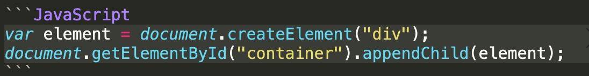

这里的element是一个对象，但是其实JavaScript（早期）里面，根本没法创建这样的对象。

一方面也是我们没有办法改变createElement这个函数的行为。

既然API风格没法靠拢DOM原生，那么就靠拢JS原生吧，所以一些前端开发同学就萌生了创建一个带容器的对象的想法：

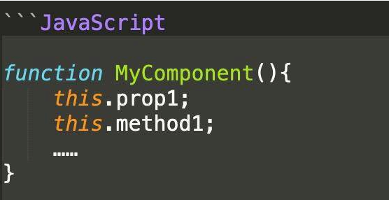

不过，要想挂载又成了难题，普通的JS对象没法被用于appendChild，所以前端工程师就有了两种思路，第一种是反过来，设计一个appendTo方法，让组件把自己挂到DOM树上去。

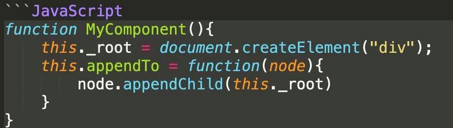

第二种比较有意思，是让组件直接返回一个DOM元素，把方法和自定义属性挂到这个元素上：

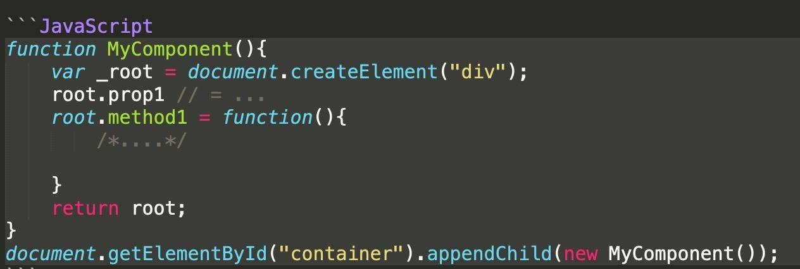

虽然从前端全领域来看，组件化到后期（2014年）才有比较普及的应用，但是早年用这样的思路实现组件体系的方案并不少，说明组件化在一些公司和领域始终有需求。虽然当时有一些组件化方案没能够影响行业，但是不可否认它们也还算是不错的解决方案，比如著名的ExtJS（现已更名为Sencha），我们来看看它的组件定义：

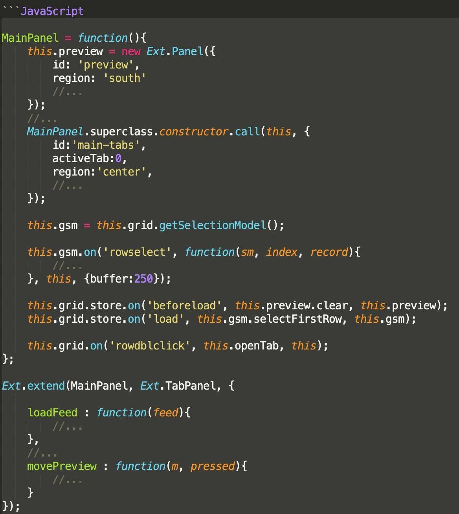

你可以看到，这是一个完全使用JS来实现组件的体系，它定义了严格的继承关系，这样的方案很好地支撑了ExtJS的前端架构。

不过，创建和挂载对象的方式可不止DOM API，还有HTML语言，如何让前端组件融合进HTML语言呢？

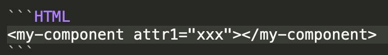

关于这方面，依赖早期标准的前端技术可以说几乎没有办法。但是，历史中总有些遗珠，微软的IE浏览器已经提供了组件化的解决方案，名为HTML Component，我找了一段非常古老的示例。

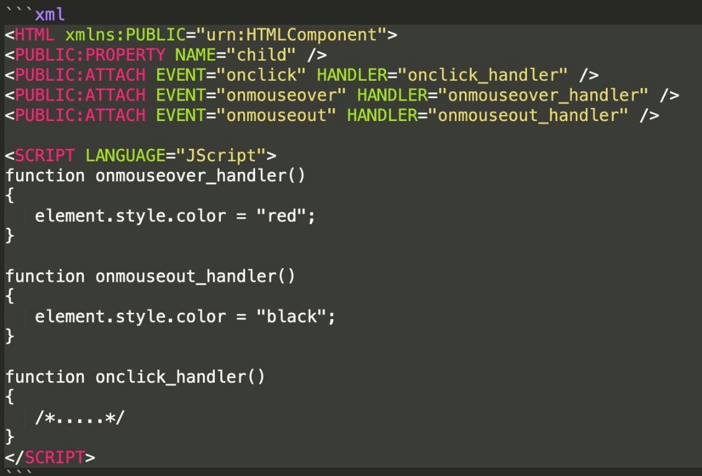

这项技术提供了事件绑定和属性、方法定义，以及一些生命周期相关的事件，应该说已经是一个比较完整的组件化方案了。但是我们可以看到后来的结果，它没有能够进入标准，默默地消失了。用我们今天的角度来看，它可以说是生不逢时。

到了“三大框架”出现的时代，因为面向的客户群体从少数公司、少数领域变成了广大前端开发群众，也因为一些新技术的出现，让旧时代组件化没法解决的问题有了新的可能性，这些新的组件化方案都保持了HTML甚至CSS的书写习惯。

Vue.js采用了JSON的方法描述一个组件：

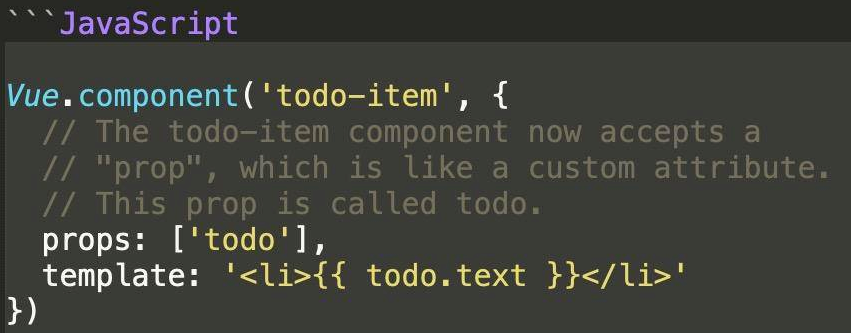

还提供了SFC（Single File Component，单文件组件）“.vue”文件格式：
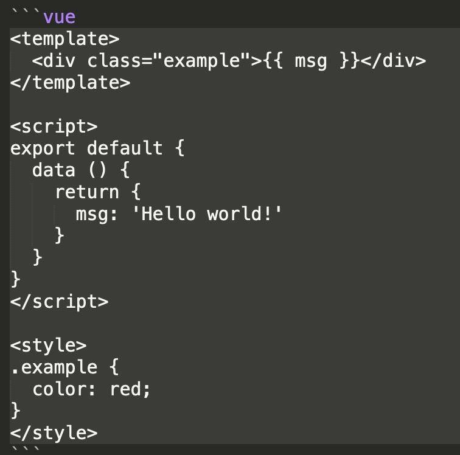

React.js发明了JSX，把CSS和HTML都塞进JS文件里：
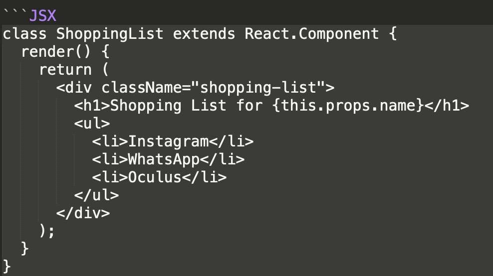

Angular.js选择在原本的HTML上扩展，定义组件的方式也是JS class：
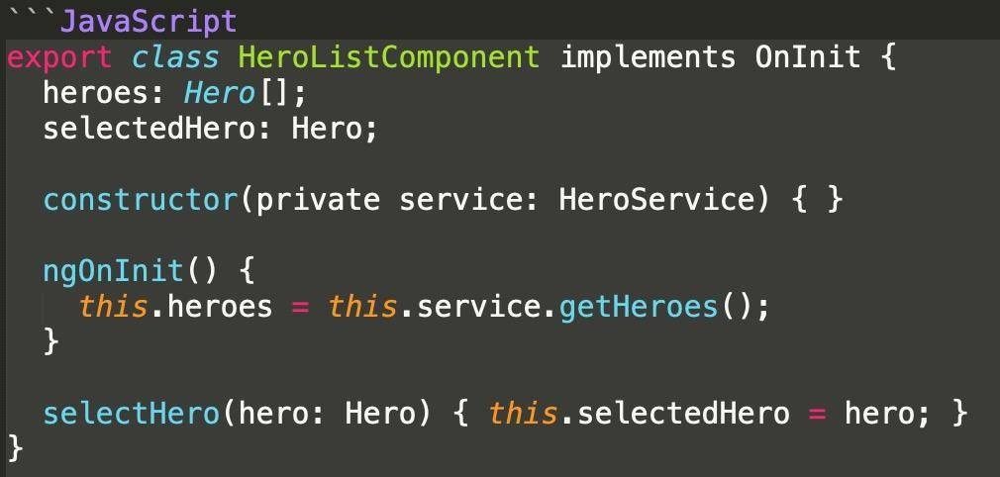

我们可以看到，现代的组件化方案跟旧时代组件化方案的一个明显区别就是，现在的组件化方案保留了原有的标记语言部分，并且努力保留了样式表部分。

虽然技术从旧到新经历了各种变迁，但是组件化的核心并没有变化，我们的目标仍然是在API设计尽可能接近原生的情况下完成复用、解耦、封装、抽象的目标，最终服务于开发，提高效率，降低错误发生比率。

如果你的公司和前端团队规模正好面临需要建立组件化体系，希望你能从今天所分享的历史中获得一点灵感。组件化的知识也是我的线下训练营很重要的部分，如果你想深入学习，欢迎你加入极客大学前端训练营。

下面给大家15分钟，请你设计一个自己的组件代码，提交到自己的GitHub仓库，然后发出链接，稍后我会现场点评并给你一些建议。

关于今天分享的内容，如果你有任何疑惑，现在也可以发出你的问题，15分钟结束后我也会回答同学们的问题。
